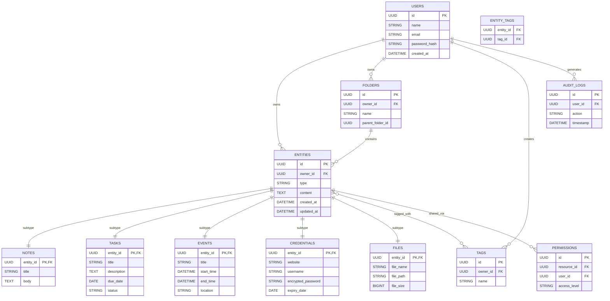

```mermaid
erDiagram

    USERS {
        UUID id PK
        STRING name
        STRING email
        STRING password_hash
        DATETIME created_at
    }

    ENTITIES {
        UUID id PK
        UUID owner_id FK
        STRING type
        TEXT content
        DATETIME created_at
        DATETIME updated_at
    }

    NOTES {
        UUID entity_id PK, FK
        STRING title
        TEXT body
    }

    TASKS {
        UUID entity_id PK, FK
        STRING title
        TEXT description
        DATE due_date
        STRING status
    }

    EVENTS {
        UUID entity_id PK, FK
        STRING title
        DATETIME start_time
        DATETIME end_time
        STRING location
    }

    CREDENTIALS {
        UUID entity_id PK, FK
        STRING website
        STRING username
        STRING encrypted_password
        DATE expiry_date
    }

    FILES {
        UUID entity_id PK, FK
        STRING file_name
        STRING file_path
        BIGINT file_size
    }

    FOLDERS {
        UUID id PK
        UUID owner_id FK
        STRING name
        UUID parent_folder_id
    }

    TAGS {
        UUID id PK
        UUID owner_id FK
        STRING name
    }

    ENTITY_TAGS {
        UUID entity_id FK
        UUID tag_id FK
    }

    PERMISSIONS {
        UUID id PK
        UUID resource_id FK
        UUID user_id FK
        STRING access_level
    }

    AUDIT_LOGS {
        UUID id PK
        UUID user_id FK
        STRING action
        DATETIME timestamp
    }

    USERS ||--o{ ENTITIES : owns
    USERS ||--o{ FOLDERS : owns
    USERS ||--o{ TAGS : creates
    USERS ||--o{ AUDIT_LOGS : generates

    ENTITIES ||--|| NOTES : subtype
    ENTITIES ||--|| TASKS : subtype
    ENTITIES ||--|| EVENTS : subtype
    ENTITIES ||--|| CREDENTIALS : subtype
    ENTITIES ||--|| FILES : subtype

    ENTITIES }o--o{ TAGS : tagged_with
    ENTITIES ||--o{ PERMISSIONS : shared_via
    FOLDERS ||--o{ ENTITIES : contains
```