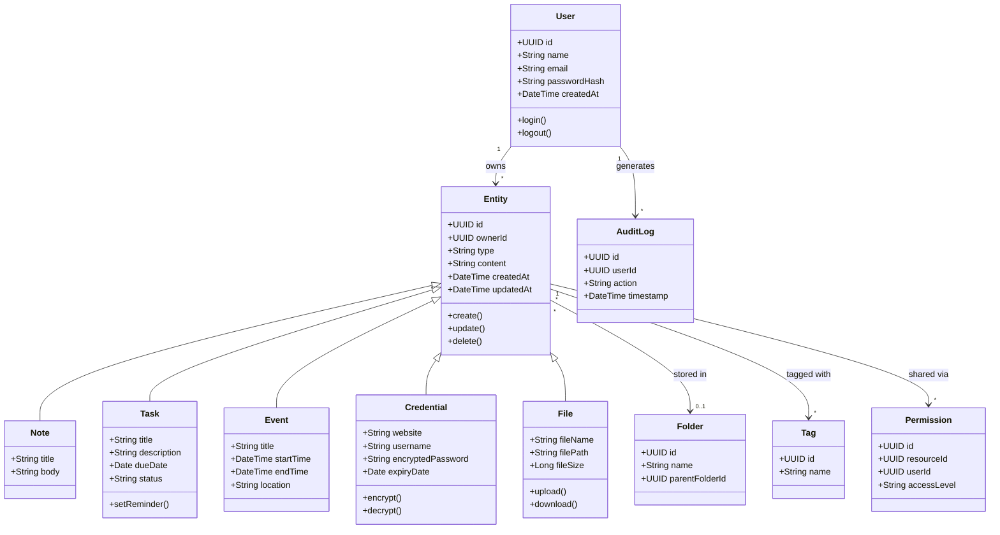

```mermaid
classDiagram

class User {
    +UUID id
    +String name
    +String email
    +String passwordHash
    +DateTime createdAt
    +login()
    +logout()
}

class Entity {
    +UUID id
    +UUID ownerId
    +String type
    +String content
    +DateTime createdAt
    +DateTime updatedAt
    +create()
    +update()
    +delete()
}

class Note {
    +String title
    +String body
}

class Task {
    +String title
    +String description
    +Date dueDate
    +String status
    +setReminder()
}

class Event {
    +String title
    +DateTime startTime
    +DateTime endTime
    +String location
}

class Credential {
    +String website
    +String username
    +String encryptedPassword
    +Date expiryDate
    +encrypt()
    +decrypt()
}

class File {
    +String fileName
    +String filePath
    +Long fileSize
    +upload()
    +download()
}

class Folder {
    +UUID id
    +String name
    +UUID parentFolderId
}

class Tag {
    +UUID id
    +String name
}

class Permission {
    +UUID id
    +UUID resourceId
    +UUID userId
    +String accessLevel
}

class AuditLog {
    +UUID id
    +UUID userId
    +String action
    +DateTime timestamp
}

User "1" --> "*" Entity : owns
Entity <|-- Note
Entity <|-- Task
Entity <|-- Event
Entity <|-- Credential
Entity <|-- File

Entity "*" --> "0..1" Folder : stored in
Entity "*" --> "*" Tag : tagged with

Entity "1" --> "*" Permission : shared via
User "1" --> "*" AuditLog : generates
```
