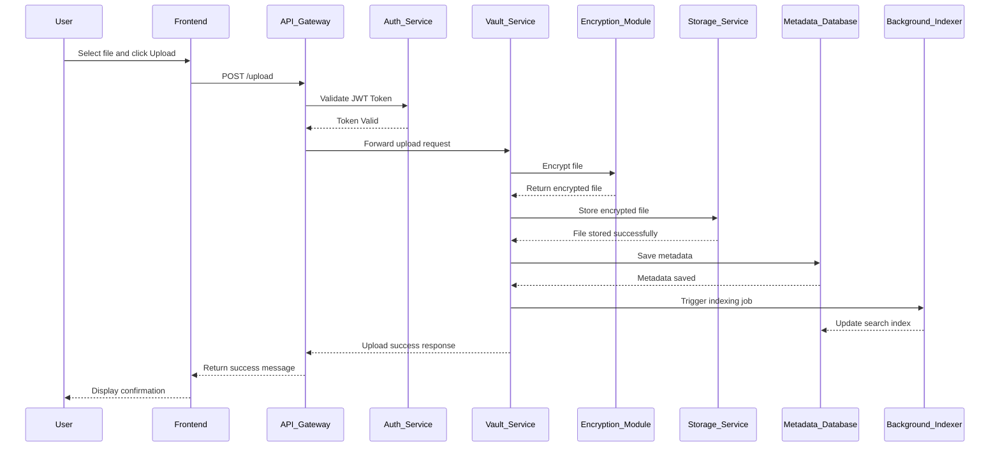

# Sequence Diagram – File Upload Flow

```mermaid
sequenceDiagram
    participant User
    participant Frontend
    participant API as API_Gateway
    participant Auth as Auth_Service
    participant Vault as Vault_Service
    participant Encrypt as Encryption_Module
    participant Storage as Storage_Service
    participant DB as Metadata_Database
    participant Worker as Background_Indexer

    User->>Frontend: Select file and click Upload
    Frontend->>API: POST /upload

    API->>Auth: Validate JWT Token
    Auth-->>API: Token Valid

    API->>Vault: Forward upload request

    Vault->>Encrypt: Encrypt file
    Encrypt-->>Vault: Return encrypted file

    Vault->>Storage: Store encrypted file
    Storage-->>Vault: File stored successfully

    Vault->>DB: Save metadata
    DB-->>Vault: Metadata saved

    Vault->>Worker: Trigger indexing job
    Worker-->>DB: Update search index

    Vault-->>API: Upload success response
    API-->>Frontend: Return success message
    Frontend-->>User: Display confirmation
```
