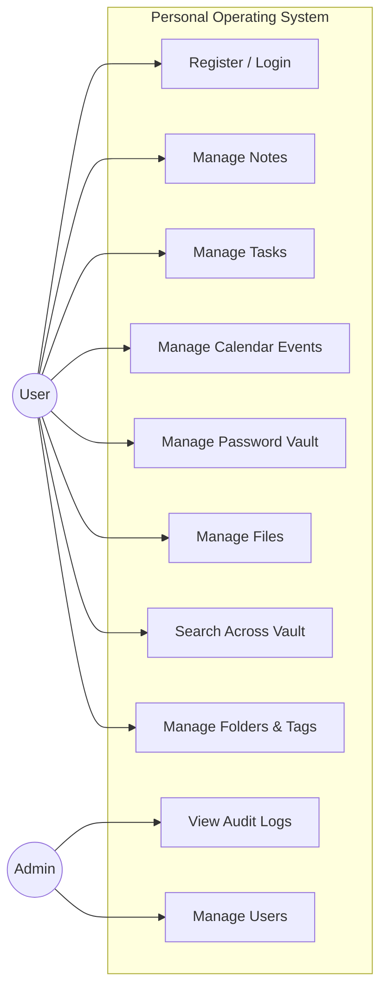

```mermaid
flowchart LR

    User((User))
    Admin((Admin))

    subgraph System["Personal Operating System"]
        UC1[Register / Login]
        UC2[Manage Notes]
        UC3[Manage Tasks]
        UC4[Manage Calendar Events]
        UC5[Manage Password Vault]
        UC6[Manage Files]
        UC7[Search Across Vault]
        UC8[Manage Folders & Tags]
        UC9[View Audit Logs]
        UC10[Manage Users]
    end


    User --> UC1
    User --> UC2
    User --> UC3
    User --> UC4
    User --> UC5
    User --> UC6
    User --> UC7
    User --> UC8


    Admin --> UC9
    Admin --> UC10
```
