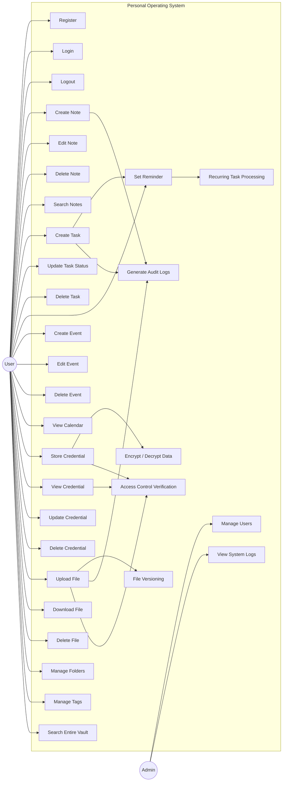

```mermaid
flowchart LR

    %% Actors
    User((User))
    Admin((Admin))

    %% System Boundary
    subgraph POS["Personal Operating System"]

        %% Authentication
        UC1[Register]
        UC2[Login]
        UC3[Logout]

        %% Notes Module
        UC4[Create Note]
        UC5[Edit Note]
        UC6[Delete Note]
        UC7[Search Notes]

        %% Task Module
        UC8[Create Task]
        UC9[Update Task Status]
        UC10[Delete Task]
        UC11[Set Reminder]
        UC12[Recurring Task Processing]

        %% Calendar Module
        UC13[Create Event]
        UC14[Edit Event]
        UC15[Delete Event]
        UC16[View Calendar]

        %% Password Vault
        UC17[Store Credential]
        UC18[View Credential]
        UC19[Update Credential]
        UC20[Delete Credential]
        UC21[Encrypt / Decrypt Data]

        %% File Storage
        UC22[Upload File]
        UC23[Download File]
        UC24[Delete File]
        UC25[File Versioning]

        %% Organization
        UC26[Manage Folders]
        UC27[Manage Tags]
        UC28[Search Entire Vault]

        %% Security
        UC29[Access Control Verification]
        UC30[Generate Audit Logs]

        %% Admin Controls
        UC31[Manage Users]
        UC32[View System Logs]

    end

    %% User interactions
    User --> UC1
    User --> UC2
    User --> UC3

    User --> UC4
    User --> UC5
    User --> UC6
    User --> UC7

    User --> UC8
    User --> UC9
    User --> UC10
    User --> UC11

    User --> UC13
    User --> UC14
    User --> UC15
    User --> UC16

    User --> UC17
    User --> UC18
    User --> UC19
    User --> UC20

    User --> UC22
    User --> UC23
    User --> UC24

    User --> UC26
    User --> UC27
    User --> UC28

    %% Admin interactions
    Admin --> UC31
    Admin --> UC32

    %% Logical relationships (simulate include)
    UC8 --> UC11
    UC11 --> UC12
    UC17 --> UC21
    UC22 --> UC25
    UC4 --> UC30
    UC8 --> UC30
    UC22 --> UC30
    UC17 --> UC29
    UC22 --> UC29
    UC18 --> UC29
```
